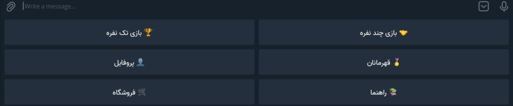

<div id="top"></div>
<!--
*** Thanks for checking out the Best-README-Template. If you have a suggestion
*** that would make this better, please fork the repo and create a pull request
*** or simply open an issue with the tag "enhancement".
*** Don't forget to give the project a star!
*** Thanks again! Now go create something AMAZING! :D
-->


<!-- PROJECT SHIELDS -->
<!--
*** I'm using markdown "reference style" links for readability.
*** Reference links are enclosed in brackets [ ] instead of parentheses ( ).
*** See the bottom of this document for the declaration of the reference variables
*** for contributors-url, forks-url, etc. This is an optional, concise syntax you may use.
*** https://www.markdownguide.org/basic-syntax/#reference-style-links
-->


<!-- PROJECT LOGO -->
<br />
<div align="center">
  <a href="https://github.com/amirrezabsh/SudokuTelegramBot">
    
  </a>

<h3 align="center">MiniSudoku 6x6</h3>

  <p align="center">
    Sudoku game bot
    <br />
    <a href="https://github.com/amirrezabsh/SudokuTelegramBot"><strong>Explore the docs »</strong></a>
    <br />
    <br />
    <a href="https://github.com/amirrezabsh/SudokuTelegramBot">View Demo</a>
    ·
    <a href="https://github.com/amirrezabsh/SudokuTelegramBot/issues">Report Bug</a>
    ·
    <a href="https://github.com/amirrezabsh/SudokuTelegramBot/issues">Request Feature</a>
  </p>
</div>


<!-- TABLE OF CONTENTS -->
<details>
  <summary>Table of Contents</summary>
  <ol>
    <li>
      <a href="#about-the-project">About The Project</a>
      <ul>
        <li><a href="#built-with">Built With</a></li>
      </ul>
    </li>
    <li>
      <a href="#getting-started">Getting Started</a>
      <ul>
        <li><a href="#prerequisites">Prerequisites</a></li>
        <li><a href="#installation">Installation</a></li>
      </ul>
    </li>
    <li><a href="#usage">Usage</a></li>
    <li><a href="#roadmap">Roadmap</a></li>
    <li><a href="#contributing">Contributing</a></li>
    <li><a href="#license">License</a></li>
    <li><a href="#contact">Contact</a></li>
    <li><a href="#acknowledgments">Acknowledgments</a></li>
  </ol>
</details>


<!-- ABOUT THE PROJECT -->
## About The Project

[![Product Name Screen Shot][product-screenshot]](https://t.me/MiniSudokuBot)


<p align="right">(<a href="#top">back to top</a>)</p>


### Built With

* [pyTelegramBotAPI](https://github.com/eternnoir/pyTelegramBotAPI)
* [Python](https://www.python.org)

<p align="right">(<a href="#top">back to top</a>)</p>


<!-- GETTING STARTED -->
## Getting Started

Just create a python project by create a virtual environment and place main.py file in your project to run.
Place your bot api_key and host info in code as well.

### Prerequisites

For installing virtual environment you should install virtualenv.
* pip
  ```sh
  pip install virtualenv
  ```

For installing telegram bot api you should install pytelegrambotapi.
* pip
  ```sh
  pip install pyTelegramBotAPI
  ```

For installing mongodb you should install mongodb.
* pip
  ```sh
  pip install mongodb
  ```

### Installation

1. Get a free API Key at telegram bot father [https://t.me/BotFather](https://t.me/BotFather)
2. Clone the repo
   ```sh
   git clone https://github.com/amirrezabsh/SudokuTelegramBot.git
   ```
3. Create a virtual environment
   ```sh
   virtualenv mypython
   ```
4. Activate your virtual environment
   ```sh
   mypthon\Scripts\activate
   ```
5. Place your API_KEY and host info and then run the code :)

<p align="right">(<a href="#top">back to top</a>)</p>


<!-- USAGE EXAMPLES -->
## Usage

After you runned the code and didn't catch any errors. You can go to your bot and send `/start` command and then you can see the menu and play with the bot.
The menu I am talking about should be like this:




<i

_For more examples, please refer to the [Documentation](https://github.com/eternnoir/pyTelegramBotAPI)_

<p align="right">(<a href="#top">back to top</a>)</p>


<!-- ROADMAP -->
## Roadmap

- [] Only persian language support
- [] Multiplayer Mode
- [] Using MongoDB as database

See the [open issues](https://github.com/amirrezabsh/SudokuTelegramBot/issues) for a full list of proposed features (and known issues).

<p align="right">(<a href="#top">back to top</a>)</p>


<!-- CONTRIBUTING -->
## Contributing

Please feel free to fork this project and work on it, for any new awesome features I am **greatly appreciated**.

If you have a suggestion that would make this better, please fork the repo and create a pull request. You can also simply open an issue with the tag "enhancement".
Don't forget to give the project a star! Thanks again!

1. Fork the Project
2. Create your Feature Branch (`git checkout -b feature/AmazingFeature`)
3. Commit your Changes (`git commit -m 'Add some AmazingFeature'`)
4. Push to the Branch (`git push origin feature/AmazingFeature`)
5. Open a Pull Request

<p align="right">(<a href="#top">back to top</a>)</p>


<!-- LICENSE -->
## License

Distributed under the GNU License. See `LICENSE.txt` for more information.

<p align="right">(<a href="#top">back to top</a>)</p>


<!-- CONTACT -->
## Contact

Your Name - [@amirrezabsh](https://twitter.com/amirrezabsh) - amirrezabsh79@gmail.com

Project Link: [https://github.com/amirrezabsh/SudokuTelegramBot](https://github.com/amirrezabsh/SudokuTelegramBot)

<p align="right">(<a href="#top">back to top</a>)</p>


<!-- ACKNOWLEDGMENTS -->
## Acknowledgments

* [https://github.com/eternnoir/pyTelegramBotAPI](https://github.com/eternnoir/pyTelegramBotAPI)
* [https://www.python.org/doc/](https://www.python.org/doc/)
* [https://docs.mongodb.com/](https://docs.mongodb.com/)

<p align="right">(<a href="#top">back to top</a>)</p>


<!-- MARKDOWN LINKS & IMAGES -->
<!-- https://www.markdownguide.org/basic-syntax/#reference-style-links -->
[contributors-shield]: https://img.shields.io/github/contributors/amirrezabsh/SudokuTelegramBot.svg?style=for-the-badge
[contributors-url]: https://github.com/amirrezabsh/SudokuTelegramBot/graphs/contributors
[forks-shield]: https://img.shields.io/github/forks/amirrezabsh/SudokuTelegramBot.svg?style=for-the-badge
[forks-url]: https://github.com/amirrezabsh/SudokuTelegramBot/network/members
[stars-shield]: https://img.shields.io/github/stars/amirrezabsh/SudokuTelegramBot.svg?style=for-the-badge
[stars-url]: https://github.com/amirrezabsh/SudokuTelegramBot/stargazers
[issues-shield]: https://img.shields.io/github/issues/amirrezabsh/SudokuTelegramBot.svg?style=for-the-badge
[issues-url]: https://github.com/amirrezabsh/SudokuTelegramBot/issues
[license-shield]: https://img.shields.io/github/license/amirrezabsh/SudokuTelegramBot.svg?style=for-the-badge
[license-url]: https://github.com/amirrezabsh/SudokuTelegramBot/blob/master/LICENSE.txt
[linkedin-shield]: https://img.shields.io/badge/-LinkedIn-black.svg?style=for-the-badge&logo=linkedin&colorB=555
[linkedin-url]: https://linkedin.com/in/amirrezabsh
[product-screenshot]: images/screenshot.png
